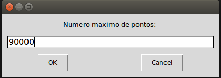
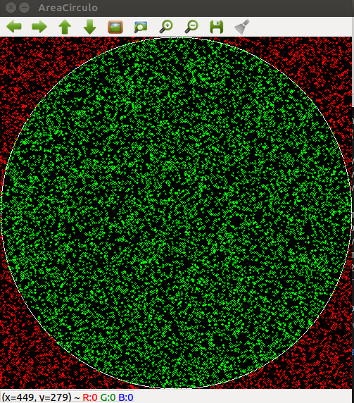
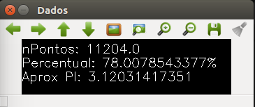

AreaCirculo
===========
Projeto de aproximação de pi a partir de probabilidade e geometria.
Há uma versão em python, utilizando openvc para gerar a interface gráfica e outra em c++ sem a interface.

# Python e Opencv.

### Pré-requisitos (Linux)
  * Python 2.7 `sudo apt-get install python`
  * OpenCV-Python Linux - [Baixe aqui](https://docs.opencv.org/3.4/d2/de6/tutorial_py_setup_in_ubuntu.html)
  
  * easygui `sudo apt-get install python-easygui`

  Exemplo de entrada: 
 

  Exemplo de círculo: 
 

  Exemplo de dados de saída: 
 

